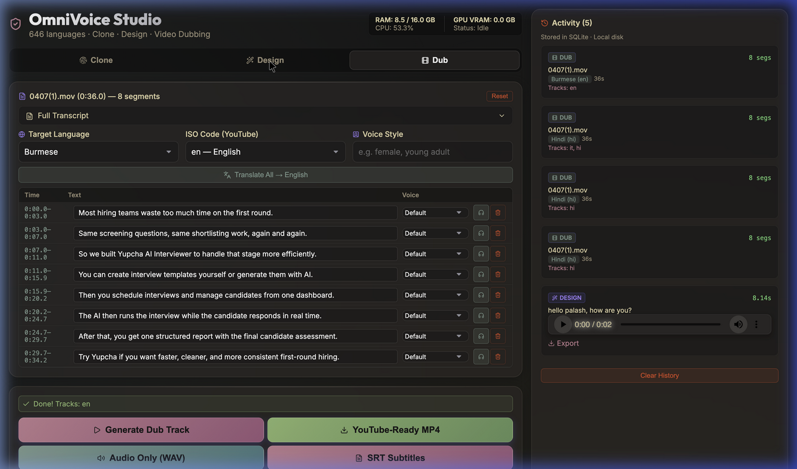
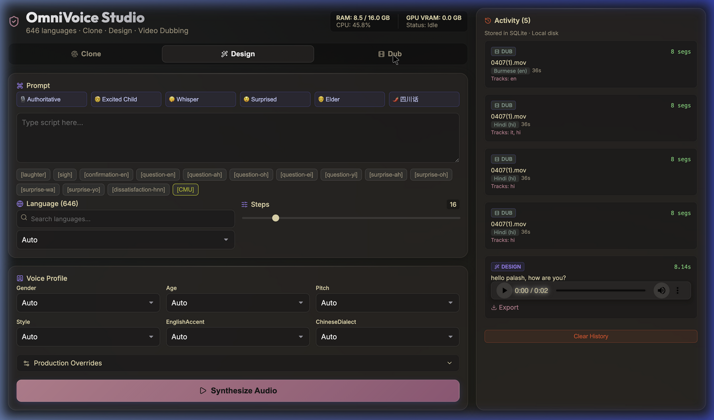

# OmniVoice Studio



OmniVoice Studio is a local, full-stack application built for fast, high-quality cinematic dubbing and custom voice generation. It wraps the 600-language zero-shot OmniVoice model into a clean workspace that works right out of the box.

## Features



- **Cinematic Dubbing:** Drop in an MP4. The studio transcribes the speech, automatically translates it into your chosen language, and mixes the newly generated voice back into the video.
- **Background Audio Mixing:** Automatically utilizes `demucs` to isolate vocals. When your dubbed audio is laid over the video, the original background music and sound effects are perfectly preserved in the mix.
- **Voice Design & Cloning:** Create entirely new voices using simple tag combinations (like `female`, `elderly`, `british accent`), or instantly clone an existing voice from just a 3-second audio snippet.
- **Runs Locally:** Fully handles its own asynchronous threading, caching, and VRAM management across Mac (Apple Silicon), NVIDIA/AMD, and CPU setups.

## Getting Started

1. Make sure `ffmpeg` is installed on your system.
2. Install [Bun](https://bun.sh/) if you don't have it.
3. Clone and run:

```bash
git clone https://github.com/k2-fsa/OmniVoice.git
cd OmniVoice
bun install
bun dev
```

The interface will load at `http://localhost:5173` (or 5174), and the API runs on port 8000. All necessary model weights will download automatically during your first generation.

---
*Powered by the open-source [OmniVoice](https://github.com/k2-fsa/OmniVoice) diffusion model.*
