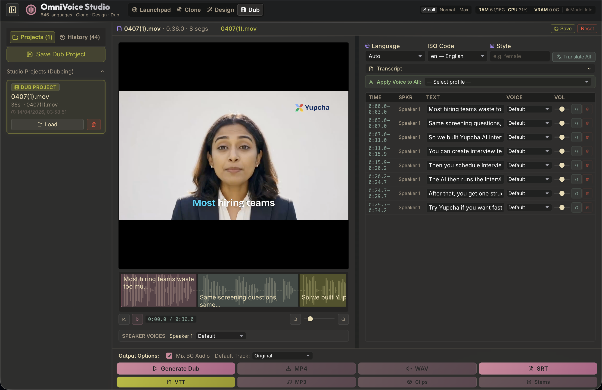

<div align="center">
  
  <h1>OmniVoice Studio</h1>
  <p><b>Your Local Cinematic AI Dubbing Studio</b></p>
  <p>
    <a href="#-features">Features</a> •
    <a href="#-getting-started">Getting Started</a> •
    <a href="#%EF%B8%8F-roadmap">Roadmap</a> •
    <a href="#-changelog">Changelog</a>
  </p>
</div>

<br/>

<div align="center">
  
  <br/>
  <i>The timeline-based cinematic dubbing and workspace UI.</i>
</div>

---

Local, full-stack voice generation and cinematic dubbing. **No API keys. No cloud. Just run it.** Built on the open-source [OmniVoice](https://github.com/k2-fsa/OmniVoice) 600-language zero-shot diffusion model.

## ✨ Features

- 🎬 **Video Dubbing** — transcribe, translate, re-voice, and mux back into MP4 with selective track export.
- 🎧 **Vocal Isolation** — built-in `demucs` automatically splits speech from music, keeping original background audio perfectly preserved.
- 🧬 **Voice Cloning & Design** — Clone specific voices from just a 3-second audio clip, or design completely new studio profiles with tags like `female, british accent, excited`.
- ⚡ **Cross-Platform Native Execution** — Auto-detects and accelerates inference using Apple Silicon (MPS), NVIDIA (CUDA), AMD (ROCm), or standard CPU.
- 🔊 **Per-Segment Mixing** — Fine-grained volume/gain control per dubbed segment (0–200%) for broadcast-quality audio balancing.
- ⌨️ **Keyboard-Driven Workflow** — `⌘+Enter` to generate, `⌘+S` to save, `⌘+Z`/`⌘+Shift+Z` for undo/redo.
- 📡 **Live Model Telemetry** — Real-time CPU/RAM/VRAM stats + model warm-up indicator (idle → loading → ready).

<br/>


## 🚀 Getting Started

Quickly get OmniVoice Studio running locally on your hardware.

**Prerequisites:** Ensure `ffmpeg` is installed on your system.
Install standard web tooling: [Bun](https://bun.sh/) and [uv](https://docs.astral.sh/uv/getting-started/installation/).

```bash
git clone https://github.com/debpalash/OmniVoice-Studio.git
cd OmniVoice-Studio

# Backend
uv sync

# Frontend
bun install
bun dev
```

OmniVoice Studio launches exactly two micro-services:

| Service | Protocol | Details |
|---|---|---|
| **Frontend** | `http://localhost:5173` | The real-time React UI — spanning cloning, design, and audio workspace. |
| **Backend** | `http://localhost:8000` | The FastAPI server handling model inference, translation pipelines, transcriber tasks. |

> [!NOTE]
> **First run optimization:** Model weights (approx. 1.2 GB) automatically download from HuggingFace the first time you execute a generation sequence. Subsequent launches trigger instantly from cache. *(Tip: Set `HF_TOKEN` in your environment for faster, authenticated downloads!)*

---

## 🗺️ Roadmap

The studio is highly functional today, but we are aggressively expanding. Watch the roadmap to see what's shipping next:

### 🌟 Completed Milestones
- [x] Zero-shot voice cloning & complex voice design.
- [x] Full video cinematic dubbing pipeline (transcribe → translate → synthesize → mux).
- [x] Vocal isolation utilizing demucs alongside background audio retention.
- [x] Embedded waveform timeline editor for micro-segment-level audio manipulation.
- [x] Live system telemetry tracking (CPU, RAM, GPU VRAM usage).
- [x] Targeted multi-speaker diarization — auto-assign unique voice profiles per active speaker.
- [x] Studio project persistence — save, load, and cache multi-track projects seamlessly via local SQLite.
- [x] Production SRT/VTT subtitle export packaged alongside the dubbed `.mp4` video output.
- [x] Selective track export — choose exactly which language tracks (Original, DE, ES, etc.) to include in final MP4.
- [x] Per-segment volume/gain control with real-time mixing (0–200%).
- [x] Undo/redo system for all segment edits with 50-action history depth.
- [x] Keyboard shortcuts: `⌘+Enter` generate, `⌘+S` save, `⌘+Z`/`⌘+Shift+Z` undo/redo.
- [x] Drag-and-drop file uploads for both video and clone audio sources.
- [x] Model warm-up indicator with live status pill (idle/loading/ready).
- [x] Confirmation dialogs for all destructive actions (delete project/history/profile).
- [x] UI preferences persistence (sidebar state, zoom, active tab) across sessions.
- [x] Polished glassmorphism design system with micro-animations, focus rings, and custom scrollbars.

### 🔨 Upcoming Features
- [x] **Real Speaker Diarization** — ML-based diarization via pyannote.audio for true multi-speaker identification.
- [x] **A/B Voice Comparison** — Side-by-side voice audition for casting decisions.
- [x] **Scene-Aware Dubbing** — FFmpeg scene detection to auto-split segments at visual cuts.
- [x] **Lip-Sync Scoring** — Analyze dubbed audio duration against original speaker timing with color-coded badges.
- [x] **Batch Processing** — Centralized async task queue ensuring sequential GPU execution with reconnectable SSE streams.
- [x] **Advanced Export Suite** — VTT subtitles, per-segment WAV ZIP, compressed MP3, and stem export (vocals + background separate).
- [x] **Streaming TTS** — Chunked WAV streaming with progressive download and auto-playback.
- [ ] **Native Desktop Applications** — Dedicated client apps for macOS, Windows, and Linux.
- [ ] **One-Click Deployment** — Docker image packages engineered for zero-config GPU passthrough.

---

## 📝 Changelog

### v1.2.0 — The Production Polish Update

- **Selective Track Export:** Choose exactly which audio tracks to include in the final MP4. Uncheck Original, keep only German — get a single-track export. Full per-track checkbox UI with dynamic FFmpeg stream index remapping.
- **Undo/Redo System:** Full `⌘+Z` / `⌘+Shift+Z` undo/redo for all segment edits (text, voice, volume, delete). 50-action deep history stack.
- **Per-Segment Volume Control:** Inline gain slider (0–200%) per segment row in the dub table. Backend applies gain during audio assembly with safe clamping.
- **Keyboard Shortcuts:** `⌘+Enter` to generate, `⌘+S` to save project. Browser default overrides prevented.
- **Model Status Indicator:** Live status pill in the header showing model warm-up state (idle → loading → ready). New `/model/status` backend endpoint.
- **Drag-and-Drop Everywhere:** Video upload already supported drop — now clone audio upload does too, with pink highlight on hover.
- **Confirmation Dialogs:** All destructive actions (delete project, profile, history item, clear all history) now require confirmation.
- **Session Persistence:** Sidebar collapsed state, active tab, and zoom level now persist across browser sessions via localStorage.
- **CSS Design System Overhaul:** Anti-aliased text, input focus glow rings, button hover shimmer, progress bar shimmer animation, fade-in on history items, selection color branding, Firefox scrollbar support, `tabular-nums` for timestamp columns.
- **AudioContext Pooling:** `playPing()` synthesis notification reuses a single AudioContext instead of creating one per call (browsers cap at ~6).

### v1.1.0 — The Cinematic Studio Update

- **The Cinematic Studio Interface:** Exhaustively re-engineered the UI to prioritize a high-density, real-estate optimized workflow featuring a dynamic UI zoom scalar (`Small`, `Normal`, `Max`). We minimized dead space and overhauled the widget layout keeping crucial tuning metrics immediately accessible.
- **Multi-Track Timeline:** Deeply integrated a multi-layered waveform sequence interface supporting precision audio segment positioning, unmuted live preview playback, localized track timing, and unconstrained draggable positioning manipulation.
- **Persistent Local Projects:** Put a complete stop to ephemeral state loss. All workspace metrics are successfully wrapped into `Projects` logged directly within a native embedded `SQLite` database. Workflows reliably survive browser shutdowns or server API reboots.
- **AI Cast Diarization:** Dropped in an offline `Pyannote` + `WhisperX` fusion pipeline evaluating multi-speaker metadata and categorizing overlapping, distinct speakers. Rapidly "cast" clone overrides seamlessly over complex dialogue tracks.
- **Polishing & Asset Control:** Cleaned cross-stack filename parsing and exported media rendering via `ffmpeg`, stabilizing codec dependencies, and deployed a unified custom `OmniVoice Studio` scalable aesthetic asset system.

<br/>

## ⭐ Star History

<div align="center">
  <a href="https://star-history.com/#debpalash/OmniVoice-Studio&Date">
    <picture>
      <source media="(prefers-color-scheme: dark)" srcset="https://api.star-history.com/svg?repos=debpalash/OmniVoice-Studio&type=Date&theme=dark" />
      <source media="(prefers-color-scheme: light)" srcset="https://api.star-history.com/svg?repos=debpalash/OmniVoice-Studio&type=Date" />
      
    </picture>
  </a>
</div>

<br/>

<div align="center">
  Contributions and conceptual ideas are greatly appreciated — open an issue or submit a PR.
</div>
