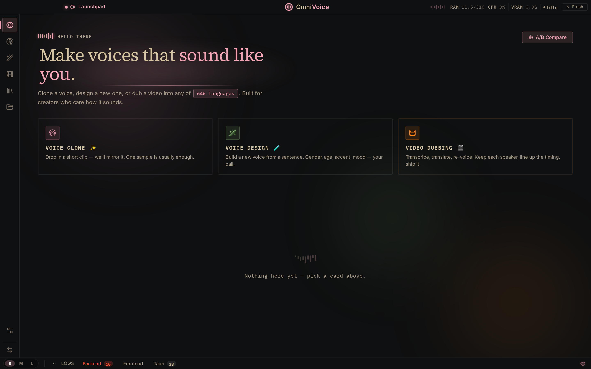
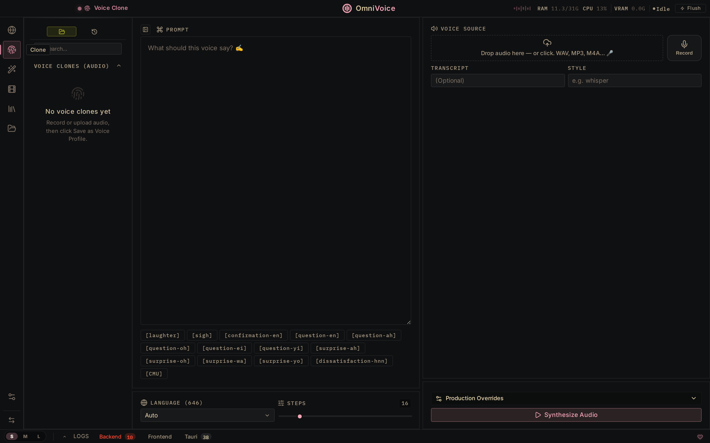
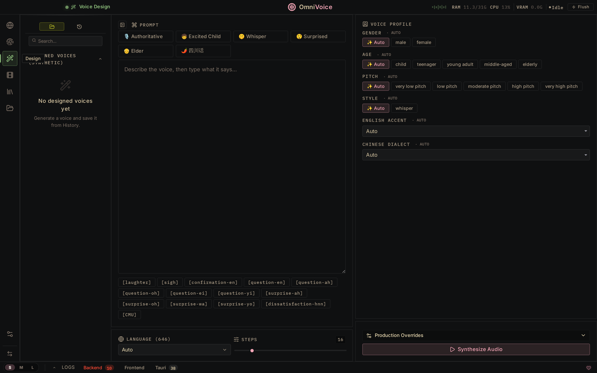
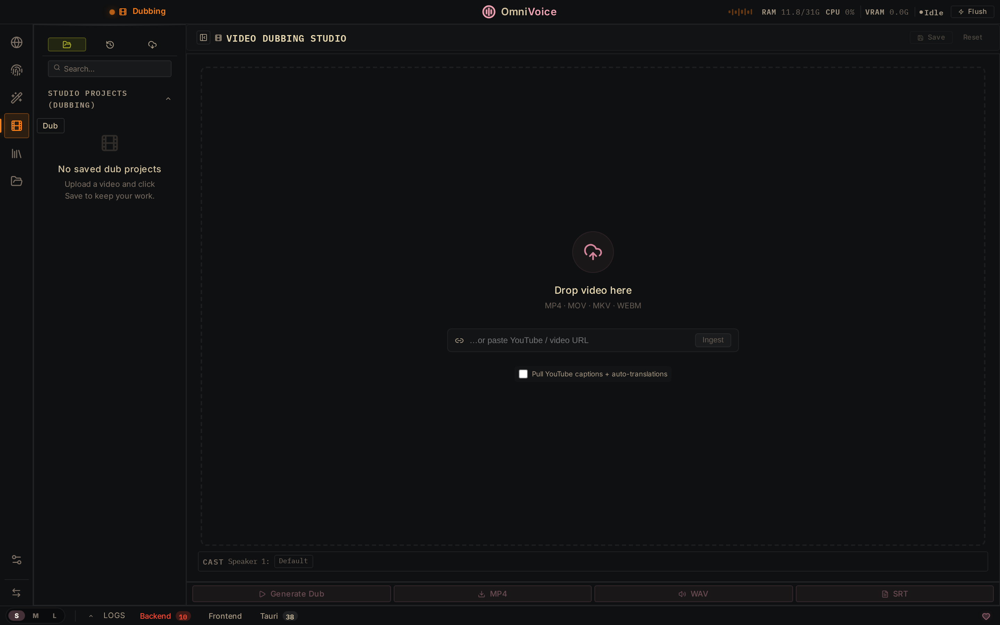
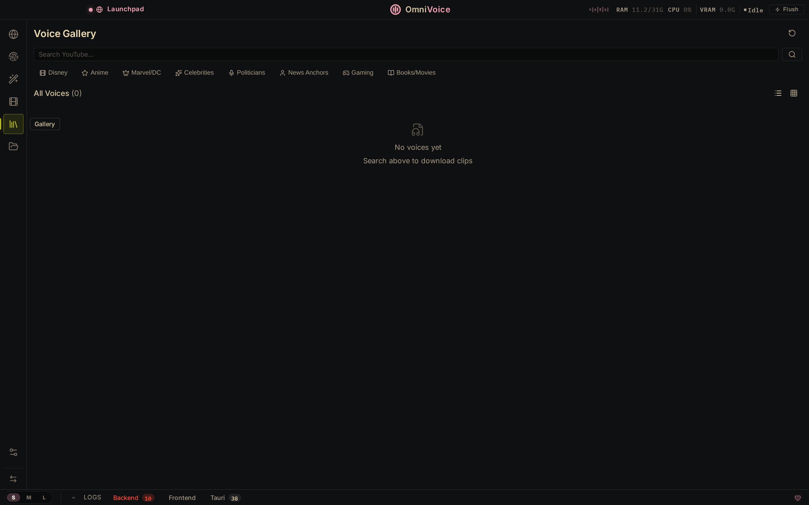
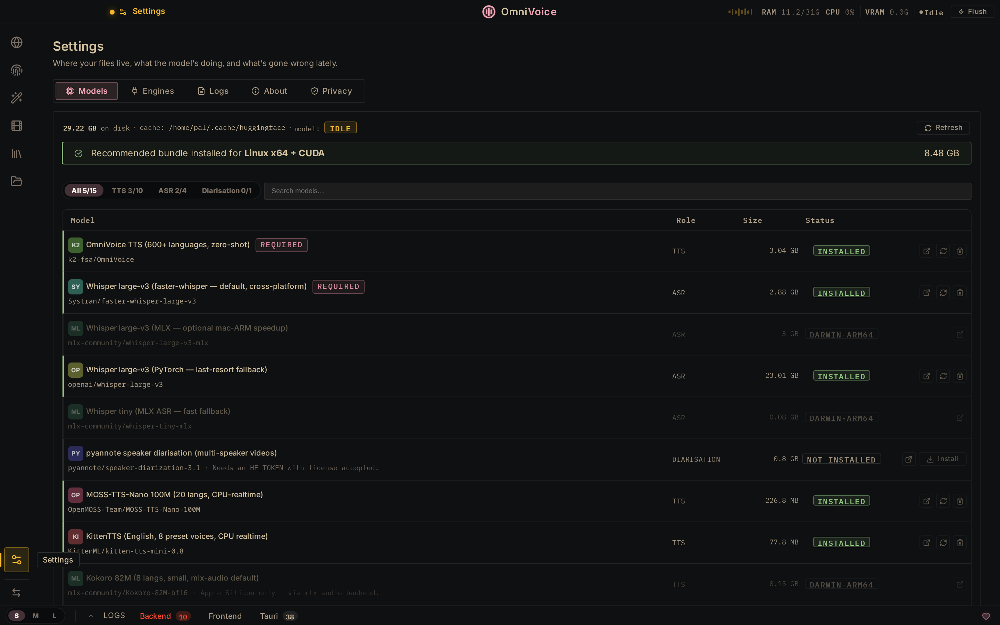
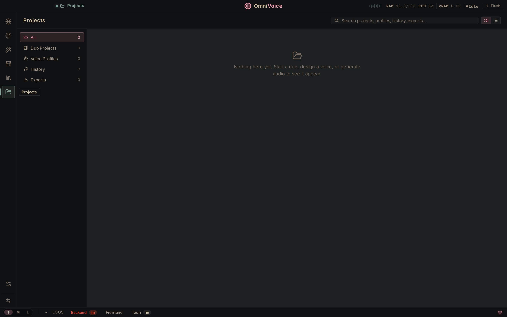
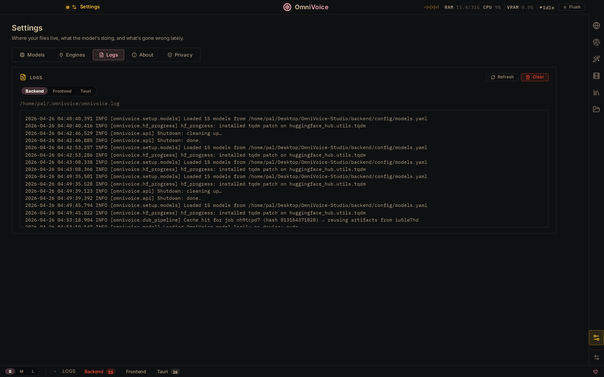

<div align="center">
  
  <h1>OmniVoice Studio</h1>
  <p><b>The open-source ElevenLabs alternative.</b></p>
  <p>Voice cloning · Voice design · Video dubbing — 646 languages, runs 100% locally, forever free.</p>
  <p>
    <a href="https://github.com/debpalash/OmniVoice-Studio/stargazers"></a>
    <a href="https://github.com/debpalash/OmniVoice-Studio/releases/latest"></a>
    <a href="LICENSE"></a>
    <a href="https://github.com/debpalash/OmniVoice-Studio/issues"></a>
    <a href="https://discord.gg/aRRdVj3de7"></a>
  </p>
  <p>
    <a href="https://github.com/debpalash/OmniVoice-Studio/releases/latest">Download</a> ·
    <a href="#features">Features</a> ·
    <a href="#quickstart">Quickstart</a> ·
    <a href="#why-open-source">Why Open Source?</a> ·
    <a href="#roadmap">Roadmap</a>
  </p>
  <p>
    <a href="https://github.com/debpalash/OmniVoice-Studio/releases/download/v0.2.5/OmniVoice.Studio_0.2.5_aarch64.dmg"></a>
    <a href="https://github.com/debpalash/OmniVoice-Studio/releases/download/v0.2.5/OmniVoice.Studio_0.2.5_x64_en-US.msi"></a>
    <a href="https://github.com/debpalash/OmniVoice-Studio/releases/download/v0.2.5/OmniVoice.Studio_0.2.5_amd64.AppImage"></a>
    <a href="https://github.com/debpalash/OmniVoice-Studio/releases/download/v0.2.5/OmniVoice.Studio_0.2.5_amd64.deb"></a>
  </p>
</div>

<br/>

<div align="center">
  
  <br/>
  <sub>Launchpad — Voice Clone · Voice Design · Video Dubbing, all in one place.</sub>
</div>

<br/>

<table>
  <tr>
    <td align="center" width="50%">
      
      <br/><b>Voice Clone</b><br/>
      <sub>Drop a 3-second clip → mirror any voice. 646 languages, zero-shot.</sub>
    </td>
    <td align="center" width="50%">
      
      <br/><b>Voice Design</b><br/>
      <sub>Build new voices from scratch — gender, age, accent, pitch, style.</sub>
    </td>
  </tr>
  <tr>
    <td align="center">
      
      <br/><b>Video Dubbing</b><br/>
      <sub>Upload or paste a YouTube URL. Transcribe, translate, re-voice, export.</sub>
    </td>
    <td align="center">
      
      <br/><b>Voice Gallery</b><br/>
      <sub>Search YouTube, browse categories, download clips, build your library.</sub>
    </td>
  </tr>
  <tr>
    <td align="center">
      
      <br/><b>Settings → Models</b><br/>
      <sub>15 models. One-click install. Auto-detects your platform (CUDA / MPS / CPU).</sub>
    </td>
    <td align="center">
      
      <br/><b>Projects</b><br/>
      <sub>Dub projects, voice profiles, generation history, exports — all searchable.</sub>
    </td>
  </tr>
  <tr>
    <td align="center" colspan="2">
      
      <br/><b>Settings → Logs</b><br/>
      <sub>Live backend, frontend, and Tauri runtime logs. Filter, refresh, clear.</sub>
    </td>
  </tr>
</table>

---

## Why Open Source?

ElevenLabs charges **$5–$330/mo** and processes your audio on their servers. OmniVoice Studio runs **on your hardware, with no usage limits.**

| | **ElevenLabs** | **OmniVoice Studio** |
|---|---|---|
| **Pricing** | $5–$330/mo, per-character billing | Free for personal use · [Commercial license](#license) for business |
| **Voice Cloning** | ✅ 3s clip | ✅ 3s clip, zero-shot |
| **Voice Design** | ✅ Gender, age | ✅ Gender, age, accent, pitch, style, dialect |
| **Languages** | 32 | **646** |
| **Video Dubbing** | ✅ Cloud-only | ✅ Fully local |
| **Data Privacy** | Audio sent to cloud | **Nothing leaves your machine** |
| **API Keys** | Required | Not needed |
| **GPU Support** | N/A (cloud) | CUDA · Apple Silicon · ROCm · CPU |
| **Desktop App** | ❌ | ✅ macOS · Windows · Linux |
| **Customizable** | ❌ Closed | ✅ Fork it, extend it, ship it |

Built on the [OmniVoice](https://github.com/k2-fsa/OmniVoice) 600-language zero-shot diffusion TTS model. Upload a video, get broadcast-quality dubs in any language with the original speaker's voice preserved.

## Features

### Core Pipeline
- **Video Dubbing** — Transcribe → translate → synthesize → mux back to MP4. One-click end-to-end.
- **Vocal Isolation** — Demucs-powered speech/music separation. Background audio preserved automatically.
- **Voice Cloning** — Clone any voice from a 3-second clip. Zero-shot, 600+ languages.
- **Multi-Speaker Diarization** — Pyannote + WhisperX fusion auto-identifies speakers and assigns unique voice profiles.

### Studio Tools
- **Voice Capture** — Press `⌘+⇧+Space` **from any app** to dictate. Global system-wide hotkey records, transcribes, and auto-pastes into the active text field. Live partial results stream via WebSocket while you speak.
- **Speaker Casting** — Visual speaker-to-voice assignment grid. Auto-cast from video clones or assign saved profiles.
- **Voice Preview** — Floating widget for instant 8-step TTS testing. Try voices without leaving the workspace.
- **Real-time Dub Preview** — Edit a segment's text, preview the audio instantly without full re-render.
- **Multi-Language Batch** — Select multiple target languages, dub to all in one pass.
- **Batch Queue** — Drag-and-drop bulk video processing. Full pipeline: extract → transcribe → translate → generate → mix → export. Real-time progress bars per job.
- **Voice Library** — Browse, favorite, tag, and convert gallery clips into permanent voice profiles.
- **A/B Comparison** — Side-by-side voice audition for casting decisions.

### Production Export
- **Selective Track Export** — Choose which language tracks to include in the final MP4.
- **Subtitle Export** — SRT and VTT generation alongside dubbed video.
- **Stem Export** — Separate vocals and background audio as individual files.
- **Per-Segment Mixing** — 0–200% gain control per segment for broadcast-quality balancing.

### Technical
- **Cross-Platform GPU** — Auto-detects CUDA, Apple Silicon (MPS), ROCm, or CPU. Includes automatic cuDNN 8/9 compatibility handling.
- **VRAM-Aware** — Automatically offloads TTS to CPU during transcription on ≤8 GB GPUs. Zero config.
- **Streaming ASR** — WebSocket-based speech-to-text (`/ws/transcribe`) delivers live partial results during recording. 2s buffer interval, configurable.
- **Auto-Paste** — Dictated text is automatically pasted into the active app via system keyboard simulation (macOS Accessibility / Windows SendInput).
- **Live Telemetry** — Real-time CPU/RAM/VRAM stats with model warm-up indicator.
- **Keyboard-First** — `⌘+Enter` generate, `⌘+S` save, `⌘+Z`/`⌘+⇧+Z` undo/redo.

### AI Provenance
- **Invisible Watermark** — AudioSeal-powered (Meta) neural watermark embedded in every generated audio. Imperceptible, survives compression/editing.
- **Detection API** — Upload any audio to `/watermark/detect` to verify OmniVoice origin with confidence score.
- **Video Branding** — Optional logo overlay on exported MP4s (5s fade-out, bottom-right).
- **Configurable** — Toggle invisible/visible watermarks independently in Settings → Privacy.

### MCP Server (AI Agent Integration)
- **Model Context Protocol** — Expose OmniVoice as an AI agent tool for Claude, Cursor, and any MCP-compatible client.
- **5 Tools** — `generate_speech`, `list_voices`, `list_personalities`, `list_languages`, `check_health`.
- **stdio + SSE** — Works locally (Claude Desktop) or remotely (networked agents).
- **Zero config** — Drop `mcp.json` into your client config and go. See [`mcp.json`](docs/mcp.json).

### Audio Effects Chain
- **6 presets** — Broadcast 📻, Cinematic 🎬, Podcast 🎙️, Warm ☀️, Bright ✨, Raw 🔇.
- **Pedalboard-powered** — Spotify's production-grade DSP (EQ, compressor, reverb, noise gate, limiter).
- **API-driven** — `GET /tools/effects` returns presets; custom chains via `apply_effects_chain()`.

### Plugin SDK (Third-Party TTS Engines)
- **Abstract interface** — Subclass `TTSPlugin` to add any TTS engine in ~50 lines.
- **Built-in plugins** — ElevenLabs (cloud) and Bark (local) ship out of the box.
- **Auto-discovery** — Drop a `.py` file in `backend/plugins/`, it registers automatically.
- **API** — `GET /tools/plugins` lists all engines and their availability status.

### GPU Safety
- **Crash sandbox** — GPU-intensive ops can run in subprocess isolation. A CUDA OOM or driver crash kills the worker, not the server.
- **6 color themes** — Gruvbox (default), Midnight Blue, Nord, Solarized, Rosé Pine, Catppuccin Mocha.

---

## Quickstart

### Docker (recommended)

```bash
git clone https://github.com/debpalash/OmniVoice-Studio.git
cd OmniVoice-Studio

# CPU mode
docker compose up --build -d

# Or with NVIDIA GPU
docker compose --profile gpu up --build -d
```

Open [http://localhost:3900](http://localhost:3900) once the health check passes. First run downloads ~4 GB of model weights — progress is shown in `docker compose logs -f`.

> **Network access:** the container binds to `127.0.0.1` only. To reach OmniVoice from another machine on your LAN, change the port mapping in `docker-compose.yml` to `"0.0.0.0:3900:3900"`. OmniVoice ships no built-in authentication — when exposing it beyond your machine, put it behind a reverse proxy with auth (Caddy `basic_auth`, nginx + htpasswd, Tailscale, etc.).

### Local Development

**Prerequisites:** [ffmpeg](https://ffmpeg.org/), [Bun](https://bun.sh/), [uv](https://docs.astral.sh/uv/)

```bash
git clone https://github.com/debpalash/OmniVoice-Studio.git
cd OmniVoice-Studio
bun install
bun run dev
```

This boots both services:

| Service | URL | Stack |
|---------|-----|-------|
| **Backend** | `localhost:3900` | FastAPI · 97 endpoints · WhisperX · Demucs · OmniVoice |
| **Frontend** | `localhost:3901` | React · Vite · Waveform timeline · Glassmorphism UI |

> [!NOTE]
> First run downloads model weights (~2.4 GB). This works out of the box — no account needed. For faster downloads, optionally set `HF_TOKEN=hf_...` in your environment ([get a free token here](https://huggingface.co/settings/tokens)).
>
> **Having issues?** Join our [Discord](https://discord.gg/aRRdVj3de7) for setup help and troubleshooting.

### Desktop App

Pre-built installers (~6–8 MB) are available on the [**Releases**](https://github.com/debpalash/OmniVoice-Studio/releases/latest) page. On first launch, the app bootstraps a Python environment and downloads model weights automatically — the splash screen shows progress.

To build from source instead:

```bash
bun run desktop    # Launches Tauri native app (macOS / Windows / Linux)
```

<details>
<summary><b>macOS — "app is damaged and can't be opened"</b></summary>
<br/>

macOS quarantines apps downloaded outside the App Store. After dragging to `/Applications`:

```bash
xattr -cr /Applications/OmniVoice\ Studio.app
```

Open normally after. One-time fix.
</details>

<details>
<summary><b>Windows — first launch takes 5–10 minutes</b></summary>
<br/>

The app bootstraps a Python virtual environment, installs dependencies, and downloads ffmpeg on first run. The splash screen shows each step. Subsequent launches start in seconds.
</details>

<details>
<summary><b>Linux — AppImage needs FUSE</b></summary>
<br/>

If FUSE isn't available, use the `.deb` package or extract-and-run:

```bash
chmod +x OmniVoice.Studio_*.AppImage
./OmniVoice.Studio_*.AppImage --appimage-extract-and-run
```
</details>

---

## System Requirements

| | **Minimum** | **Recommended** |
|---|---|---|
| **OS** | Windows 10, macOS 12+, Ubuntu 20.04+ | Any modern 64-bit OS |
| **RAM** | 8 GB | 16 GB+ |
| **VRAM (GPU)** | 4 GB (auto-offloads TTS to CPU) | 8 GB+ (NVIDIA RTX 3060+) |
| **Disk** | 10 GB free (models + cache) | 20 GB+ SSD |
| **Python** | 3.10+ (managed by `uv`) | 3.11–3.12 |
| **GPU** | Optional — CPU works | NVIDIA CUDA · Apple Silicon MPS · AMD ROCm |

> [!TIP]
> On GPUs with **≤8 GB VRAM**, OmniVoice automatically offloads TTS to CPU during transcription — no config needed. A dedicated GPU is not required; the entire pipeline runs on CPU (just slower).

---

## Architecture

```
┌─────────────────────────────────────────────────┐
│                  Frontend (React)                │
│  DubTab · VoicePreview · BatchQueue · Gallery    │
├─────────────────────────────────────────────────┤
│                Backend (FastAPI)                  │
│  97 API endpoints · SSE streaming · SQLite       │
├──────────┬──────────┬──────────┬────────────────┤
│ WhisperX │  Demucs  │OmniVoice │   Pyannote     │
│   ASR    │  Source  │   TTS    │  Diarization   │
│          │  Sep.    │          │                │
└──────────┴──────────┴──────────┴────────────────┘
        CUDA / MPS / ROCm / CPU (auto-detected)
```

---

## Roadmap

### ✅ Shipped

| Category | Features |
|----------|----------|
| **Dubbing** | Full pipeline (transcribe→translate→synthesize→mux), scene-aware splitting, lip-sync scoring, streaming TTS |
| **Voice** | Zero-shot cloning, voice design, A/B comparison, voice preview widget, gallery with favorites/tags |
| **Audio** | Demucs vocal isolation, per-segment gain, selective track export, stem/SRT/VTT/MP3 export |
| **Multi-Lang** | Multi-language batch picker, batch dubbing queue with sequential GPU execution |
| **Diarization** | Pyannote ML diarization, auto speaker clone extraction, per-speaker voice assignment |
| **Infra** | Docker deployment, CUDA/MPS/ROCm auto-detect, cuDNN 8 compat, VRAM-aware model offloading |
| **AI Provenance** | AudioSeal invisible watermarking (SynthID-like), video logo overlay, watermark detection API |
| **UX** | Undo/redo, keyboard shortcuts, drag-and-drop, session persistence, glassmorphism design system |
| **Real-time Events** | WebSocket event bus — instant sidebar refresh on data mutations, exponential backoff reconnect |
| **State Management** | Zustand store migration — `uiSlice`, `pillSlice`, `dubSlice`, `generateSlice`, `prefsSlice`, `glossarySlice` |
| **Desktop** | Cross-platform Tauri installers (macOS DMG, Windows MSI, Linux deb/AppImage), auto-update infrastructure |
| **Windows Hardening** | Cross-platform log paths, Triton workaround, HF symlink bypass, 300s health check timeout |
| **Dictation** | Global system-wide hotkey (`⌘+⇧+Space`), streaming ASR via WebSocket, auto-paste into active app |
| **Batch Pipeline** | Full batch TTS: extract → transcribe → translate → generate → mix → export, with live progress tracking |

### 🔜 Roadmap — completed ✅

**All planned features have been shipped.**

- ~~Onboarding sample clip~~ · ~~Docker DX~~ · ~~Auto-updater~~ · ~~Deferred disk writes~~
- ~~MCP server~~ · ~~Voice personalities~~ · ~~Audio effects chain~~ · ~~i18n framework~~
- ~~Global hotkey dictation~~ · ~~Real-time dub preview~~ · ~~Speaker casting view~~
- ~~Theme system~~ · ~~Plugin SDK~~ · ~~GPU crash sandbox~~ · ~~Waveform v2~~
- ~~Batched TTS~~ · ~~Cold start optimization~~ · ~~Audiobook editor~~ · ~~Context-aware pipeline~~

---

## FAQ

<details>
<summary><b>Is this really as good as ElevenLabs?</b></summary>
<br/>
For voice cloning and dubbing, yes — OmniVoice uses a state-of-the-art diffusion TTS model with 646 languages (ElevenLabs supports 32). Quality is comparable for most use cases. Where ElevenLabs wins is in their polished cloud API and pre-made voice library. OmniVoice wins on privacy, cost, language coverage, and customizability.
</details>

<details>
<summary><b>Does it work on Apple Silicon (M1/M2/M3/M4)?</b></summary>
<br/>
Yes. MPS acceleration is auto-detected. MLX-optimized Whisper models are available for faster transcription on Apple hardware.
</details>

<details>
<summary><b>How much VRAM do I need?</b></summary>
<br/>
<b>4 GB minimum.</b> With ≤8 GB, the TTS model is automatically offloaded to CPU during transcription. With 8+ GB, everything runs on GPU simultaneously. No GPU at all? CPU mode works — just slower (~3× for TTS).
</details>

<details>
<summary><b>Can I use this commercially?</b></summary>
<br/>
Personal, educational, internal-team, and non-commercial use is free under <a href="https://fsl.software/">FSL-1.1-ALv2</a>. Building a competing product or service on top of OmniVoice Studio requires a commercial license — see <a href="#license">License</a>. Pricing tiers coming soon. Each release converts to Apache 2.0 two years after publication.
</details>

<details>
<summary><b>What languages are supported?</b></summary>
<br/>
646 languages for TTS via the OmniVoice model. Transcription (WhisperX) supports 99 languages. Translation coverage depends on the target language pair.
</details>

<details>
<summary><b>Can I add my own TTS engine?</b></summary>
<br/>
Not yet — a Plugin SDK is on the <a href="#roadmap">roadmap</a>. The architecture is modular, so integration is straightforward for contributors.
</details>

---

## License

OmniVoice Studio is source-available under the [**Functional Source License (FSL-1.1-ALv2)**](https://fsl.software/).

**Free** for personal, educational, research, internal team, and non-commercial use. Each release **converts to Apache 2.0 automatically two years after publication**.

**Business / enterprise** users building a competing product or service on top of OmniVoice Studio need a commercial license. **Pricing tiers coming soon.** For inquiries in the meantime, reach out at **OmniVoice@palash.dev**.

See [`LICENSE`](LICENSE) for the full terms.

---

## Contributing

Issues and PRs welcome. See the [roadmap](#roadmap) for areas where help is most needed. Join our [Discord](https://discord.gg/aRRdVj3de7) to discuss ideas, get help, or find what to work on.

---

## Acknowledgments

OmniVoice Studio is built on the shoulders of exceptional open-source work:

| Project | Role |
|---------|------|
| [**OmniVoice (k2-fsa)**](https://github.com/k2-fsa/OmniVoice) | Zero-shot diffusion TTS engine — the core voice synthesis model |
| [**WhisperX**](https://github.com/m-bain/whisperX) | Word-level speech recognition and alignment |
| [**Demucs (Meta)**](https://github.com/facebookresearch/demucs) | Music source separation for vocal isolation |
| [**Pyannote**](https://github.com/pyannote/pyannote-audio) | Speaker diarization — who said what |
| [**CTranslate2**](https://github.com/OpenNMT/CTranslate2) | Optimized Transformer inference on CPU and GPU |
| [**AudioSeal (Meta)**](https://github.com/facebookresearch/audioseal) | Invisible neural audio watermarking for AI provenance |
| [**Tauri**](https://tauri.app) | Native desktop app framework |

---

<div align="center">

**[⭐ Star on GitHub](https://github.com/debpalash/OmniVoice-Studio)** to follow updates.

  <a href="https://star-history.com/#debpalash/OmniVoice-Studio&Date">
    <picture>
      <source media="(prefers-color-scheme: dark)" srcset="https://api.star-history.com/svg?repos=debpalash/OmniVoice-Studio&type=Date&theme=dark" />
      <source media="(prefers-color-scheme: light)" srcset="https://api.star-history.com/svg?repos=debpalash/OmniVoice-Studio&type=Date" />
      
    </picture>
  </a>
</div>
