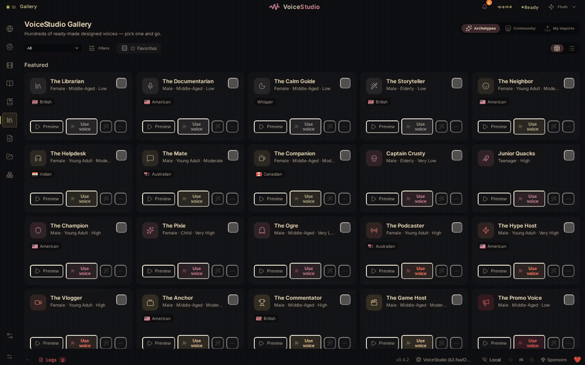
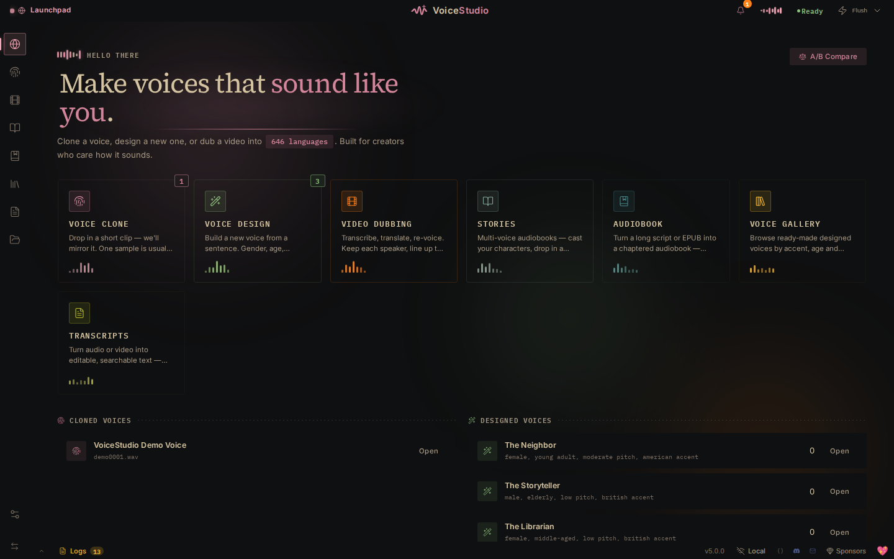
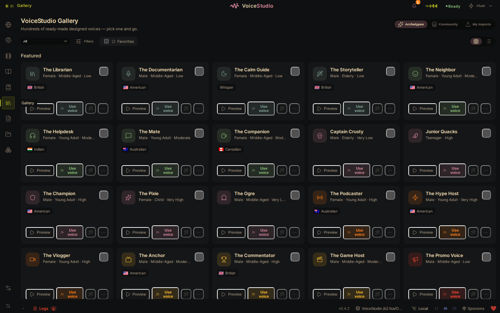

<div align="center">
  
  <h1>VoiceStudio</h1>
  <p><sub><em>previously OmniVoice-Studio</em></sub></p>
  <h3>Make voices. Tell stories. Keep the files. ♡</h3>
  <p>Clone, design, dub, dictate, and build audiobooks in one open-source desktop studio.<br/><b>Local-first by default.</b> No subscription or usage meter. Optional online services stay opt-in.</p>

  <p>
    <a href="#quickstart">Quickstart</a> ·
    <a href="#features">Features</a> ·
    <a href="#why-voicestudio">Why VoiceStudio</a> ·
    <a href="#tts-engines">Engines</a> ·
    <a href="#openai-api">API</a> ·
    <a href="#sponsor--donate">Donate</a> ·
    <a href="#contributing">Contributing</a> ·
    <a href="https://voicestudio.sh">Website</a> ·
    <a href="https://voicestudio.sh/docs">Docs</a> ·
    <a href="https://status.voicestudio.sh">Status</a> ·
    <a href="https://discord.gg/bzQavDfVV9">Discord</a> ·
    <a href="https://x.com/idebpalash">X</a> ·
    <a href="README_CN.md"><strong>简体中文</strong></a>
  </p>

  <p>
    <a href="https://github.com/debpalash/VoiceStudio/stargazers"></a>
    <a href="https://github.com/debpalash/VoiceStudio/releases"></a>
    <a href="https://github.com/debpalash/VoiceStudio/releases/latest"></a>
    <a href="LICENSE"></a>
    <a href="https://github.com/debpalash/VoiceStudio/issues"></a>
    <a href="https://discord.gg/bzQavDfVV9"></a>
    <a href="https://x.com/idebpalash"></a>
    <a href="https://ko-fi.com/debpalash"></a>
    <a href="https://paypal.me/palashCoder"></a>
  </p>

  <p>
    <a href="https://github.com/debpalash/VoiceStudio/releases/latest"></a>
  </p>

  <p>
    <a href="https://trendshift.io/repositories/28176?utm_source=trendshift-badge&utm_medium=badge&utm_campaign=badge-trendshift-28176" target="_blank" rel="noopener noreferrer"></a>
  </p>
</div>

<br/>

<div align="center">
  
</div>

> **Your voice is personal. Your studio should feel personal too.** VoiceStudio keeps its core workflow on your hardware: clone, design, dub, dictate, and publish in 646 languages without a subscription or usage meter. Network-backed engines and services are optional, visible choices—not hidden requirements.

> [!WARNING]
> **Active beta.** Things may break between releases — for the newest fixes, run from source. Bug reports and PRs are very welcome: [open an issue](https://github.com/debpalash/VoiceStudio/issues) or [join Discord](https://discord.gg/bzQavDfVV9).

<a id="quickstart"></a>

## ⚡ Quickstart

<div align="center">
  <a href="https://github.com/debpalash/VoiceStudio/releases/latest"></a>
  <a href="https://github.com/debpalash/VoiceStudio/releases/latest"></a>
  <a href="https://github.com/debpalash/VoiceStudio/releases/latest"></a>
  <br/>
  <sub>Each button opens the latest-release page — download the installer for your OS from the assets list.</sub><br/>
  <sub><b>macOS:</b> first launch needs a one-time approval — right-click → <b>Open</b> (or System Settings → Privacy &amp; Security → <b>"Open Anyway"</b> on macOS 15). No Terminal needed. <a href="docs/install/macos.md#gatekeeper-quarantine">Why?</a> · <b>Intel Macs:</b> local backend unsupported (<a href="https://github.com/debpalash/VoiceStudio/issues/889">#889</a>) — <a href="docs/install/macos.md">details</a>.</sub>
</div>

**Install guide:** [🍎 macOS](docs/install/macos.md) · [🪟 Windows](docs/install/windows.md) · [🐧 Linux](docs/install/linux.md) · [🐳 Docker](docs/install/docker.md)

**Your first cloned voice, in three steps:**

1. **Install & launch.** The first launch sets up its own Python runtime and downloads model weights — the splash screen narrates every step (one-time, a few minutes; instant after that).
2. **Open Voice Cloning** from the Launchpad and drop in a **3-second clip** of any voice.
3. **Type a line, hit Generate.** The audio is yours — created and stored on your machine, in any of 646 languages.

<details>
<summary><b>🧰 Troubleshooting · slow generation · HF tokens · restricted networks</b></summary>

<br/>

- **Something broke?** Run the self-check — **Settings → About → "Run self-check"** (or `uv run python backend/main.py --diagnose --deep`) — then the [top 10 install errors](docs/install/troubleshooting.md). **"Save diagnostic bundle"** packages scrubbed logs for a bug report.
- **Feels slow?** [docs/performance.md](docs/performance.md) — where the time goes and how to tune it. Measured numbers per engine/device: [docs/benchmarks.md](docs/benchmarks.md).
- **Want breaths, laughter, emotion?** [docs/expressive-speech.md](docs/expressive-speech.md) — what each engine can do today.
- **HF tokens · diarization · download speed / mirrors:** [tokens](docs/setup/huggingface-token.md) · [diarization](docs/features/diarization.md) · [downloads](docs/downloading-models.md).
- **Coming from [Real-Time-Voice-Cloning](https://github.com/CorentinJ/Real-Time-Voice-Cloning)?** [Migration guide](docs/migration/real-time-voice-cloning.md).

</details>

---

<a id="whats-new"></a>

## 🆕 What's new in 0.5.0

The rename release — full notes: [v0.5.0 release](https://github.com/debpalash/VoiceStudio/releases/tag/v0.5.0) · [CHANGELOG](CHANGELOG.md).

- 🏷️ **A new name** — VoiceStudio (previously OmniVoice-Studio): one waveform-and-spark identity across app, docs, and installers. Your data folder, settings, and Docker image paths stay put.
- 📚 **Model Catalogue** — engines and models in one workspace: every TTS, ASR, and LLM engine with its device routing and install state; pick defaults, install or remove weights.
- ⚡ **Engine quick-switch** — change TTS/ASR/LLM engines from the status bar or anywhere with <kbd>Ctrl</kbd>/<kbd>Cmd</kbd>+<kbd>E</kbd> — ready-only choices, memory status, environment-pin protection.
- 🖧 **Remote GPU workers** — lend another machine's GPU with a join code and a QR scan; a **Compute** control picks where jobs run, and several people can share one GPU box over revocable, certificate-pinned connections.
- 🔐 **Hardened server mode** — admin actions require an API key, exchanged for short-lived scoped sessions that never sit in browser storage or WebSocket URLs.
- 💾 **Gallery voices → local profiles** — save any gallery voice as a profile of your own and use it in every picker.
- 🎤 **Dictation on Wayland** — the portal shortcut actually fires now, and the recording pill is back on every desktop.

<div align="center">
  
  <br/><sub>The Launchpad — every workspace one click away; quick-switch engines anywhere with <kbd>Ctrl</kbd>/<kbd>Cmd</kbd>+<kbd>E</kbd> (shown above)</sub>
</div>

<br/>

<table>
<tr>
  <td width="50%"></td>
  <td width="50%"></td>
</tr>
<tr>
  <td align="center"><sub><b>Model Catalogue</b> — every engine, its routing and install state</sub></td>
  <td align="center"><sub><b>Gallery → profile</b> — keep a gallery voice as your own</sub></td>
</tr>
</table>

<a id="features"></a>

## ✨ Features

Three flagships, five more headliners, and a dozen under the fold.

<table>
<tr>
  <td width="33%"></td>
  <td width="33%"></td>
  <td width="33%"></td>
</tr>
<tr>
  <td align="center">🎙️ <b>Voice Cloning</b><br/><sub>3-sec clip → any voice · 646 languages · zero-shot</sub></td>
  <td align="center">🎨 <b>Voice Design</b><br/><sub>Describe it — gender, age, accent, emotion</sub></td>
  <td align="center">🎬 <b>Video Dubbing</b><br/><sub>Transcribe → translate → re-voice → MP4</sub></td>
</tr>
</table>

<table>
<tr>
  <td align="center" width="20%">📖<br/><b>Audiobook</b><br/><sub>EPUB/PDF → .m4b, multi-voice cast</sub></td>
  <td align="center" width="20%">🎭<br/><b>Stories</b><br/><sub>Multi-voice script editor</sub></td>
  <td align="center" width="20%">⌨️<br/><b>Dictation Widget</b><br/><sub><kbd>⌘⇧Space</kbd> in any app</sub></td>
  <td align="center" width="20%">🔐<br/><b>Local-first</b><br/><sub>Core creation stays on your machine</sub></td>
  <td align="center" width="20%">🤖<br/><b>MCP Server</b><br/><sub>Use from Claude, Cursor, …</sub></td>
</tr>
</table>

<details>
<summary><b>…and 12 more</b> — catalogue, remote GPUs, isolation, diarization, batch, watermarking, and friends</summary>

<br/>

- 📚 **Model Catalogue** — one workspace for every TTS/ASR/LLM engine and model: defaults, device routing, install or remove weights — and quick-switch engines from anywhere with <kbd>Ctrl</kbd>/<kbd>Cmd</kbd>+<kbd>E</kbd>.
- 🖧 **Remote GPU workers** — send jobs to GPUs on your other machines: join code + QR enrolment, Remote Model Downloads with per-worker live progress, chapter-by-chapter audiobook rendering with local fallback. Off by default; see [docs/remote-workers.md](docs/remote-workers.md).
- 🔊 **Vocal Isolation** — Demucs-powered: splits speech from music and keeps the background bed.
- 👥 **Speaker Diarization** — Pyannote + WhisperX auto-identify who said what.
- 📦 **Batch Queue** — drop 50 videos, walk away; per-job progress bars.
- 🛡️ **AI Watermark** — AudioSeal (Meta): invisible, survives compression.
- 🔬 **Diagnostics** — self-check suite, error journal, scrubbed diagnostic bundles.
- ⚡ **GPU Auto-Detect & Routing** — CUDA · MPS · ROCm (Linux, opt-in) · CPU; ≤8 GB VRAM auto-offloads; per-engine GPU preflight, no silent CPU fallback.
- 🧩 **Extensible** — subclass `TTSBackend`, add any engine in ~50 lines.
- 🎒 **Portable personas** — export voices as `.ovsvoice` bundles: identity + watermark.
- ♾️ **Unlimited TTS** — sentence-chunked generation, no length cap, streaming via WebSocket.
- 🧠 **Dictation + LLM** — local-LLM cleanup of transcripts, optional echo cancellation.

</details>

---

<a id="why-voicestudio"></a>

## ⚖️ Why VoiceStudio

Cloud voice tools are convenient, but they put your workflow behind an account, a meter, and somebody else's infrastructure. VoiceStudio gives you a capable studio that runs on your hardware, with optional integrations when you choose them.

| | **ElevenLabs** | **VoiceStudio** |
|---|---|---|
| **Pricing** | Subscription and usage limits | Free & open-source (AGPL-3.0) · [Commercial license](#license) for proprietary use |
| **Voice Cloning** | ✅ 3s clip | ✅ 3s clip, zero-shot |
| **Voice Design** | ✅ Gender, age | ✅ Gender, age, accent, pitch, style, dialect |
| **Audiobook / Stories** | ❌ | ✅ Full audiobook editor + multi-voice stories (EPUB/PDF import, .m4b export) |
| **Languages** | Plan/model dependent | **646** |
| **Video Dubbing** | ✅ Cloud-only | ✅ Fully local |
| **Data Privacy** | Audio is processed remotely | Core workflow runs locally; online services are explicit opt-ins |
| **API Keys** | Account required | Not needed for the local workflow |
| **GPU Support** | N/A (cloud) | CUDA · Apple Silicon · ROCm (Linux) · CPU — plus your other machines' GPUs as [remote workers](docs/remote-workers.md) |
| **Desktop App** | ❌ | ✅ macOS · Windows · Linux |
| **TTS Engines** | 1 | **16** — [full matrix](#tts-engines) |
| **ASR Engines** | 1 | **11** — [full lineup](#asr-engines) |
| **MCP Server** | ❌ | ✅ Use from Claude, Cursor, any MCP client |
| **Self-check** | ❌ | ✅ Diagnostics suite, error journal, scrubbed debug bundles |
| **Customizable** | ❌ Closed | ✅ Fork it, extend it, ship it |

Professional-grade voice AI, minus the subscription and the cloud. Convinced? [Come build with us.](https://discord.gg/bzQavDfVV9)

---

## 🖥️ System Requirements

| | **Minimum** | **Recommended** |
|---|---|---|
| **OS** | Windows 10, macOS 13.3+ (Apple Silicon), Ubuntu 24.04+ (glibc 2.39+) | Any modern 64-bit OS |
| **RAM** | 8 GB | 16 GB+ |
| **VRAM (GPU)** | 4 GB (auto-offloads TTS to CPU) | 8 GB+ (NVIDIA RTX 3060+) |
| **Disk** | 10 GB free (models + cache) | 20 GB+ SSD |
| **Python** | 3.10+ (managed by `uv`) | 3.11–3.12 |
| **GPU** | Optional — CPU works | NVIDIA CUDA · Apple Silicon MPS · AMD ROCm (Linux only) |

> [!NOTE]
> **A GPU is optional** — the whole pipeline runs on CPU (just slower), and on ≤8 GB VRAM, TTS auto-offloads to CPU. Caveats: **AMD ROCm** is Linux-only + opt-in ([Linux](docs/install/linux.md#amd-gpu-rocm)) — Windows AMD/Ryzen AI is CPU-only ([Windows](docs/install/windows.md#gpu-support)); **macOS Intel** can't run the local backend, so point it at a remote one ([#889](https://github.com/debpalash/VoiceStudio/issues/889) · [macOS](docs/install/macos.md)).

<a id="tts-engines"></a>

### 🗣️ TTS Engines

**16 engines, one picker.** VoiceStudio (default, 600+ languages) is always available; seven more are opt-in and auto-detected (CosyVoice 3, GPT-SoVITS, VoxCPM2, MOSS-TTS-Nano, KittenTTS, MLX-Audio, Sherpa-ONNX), plus eight lazy-installed opt-ins (IndexTTS 2.5, OmniVoice GGUF, OmniVoice subprocess, PocketTTS, Supertonic 3, MOSS-TTS-v1.5, dots.tts, Confucius4-TTS). Switch in **Model Catalogue → Engines** — or from anywhere with <kbd>Ctrl</kbd>/<kbd>Cmd</kbd>+<kbd>E</kbd>; the choice applies everywhere synthesis happens. **Every engine has its own guide: [docs/engines](docs/engines/README.md).**

<details>
<summary><b>📊 The full matrix</b> — 16 engines × platform × clone/instruct × license</summary>

<br/>

| Engine | Languages | Clone | Instruct | Linux | macOS ARM | Windows | License |
|--------|:---------:|:-----:|:--------:|:-----:|:---------:|:-------:|:-------:|
| **VoiceStudio** (default, powered by k2-fsa/OmniVoice) | 600+ | ✅ | ✅ | ✅ CUDA/CPU | ✅ MPS | ✅ CUDA/CPU | Built-in |
| **CosyVoice 3** | 9 + 18 dialects | ✅ | ✅ | ✅ CUDA/CPU | ✅ CPU | ✅ CUDA/CPU | Apache-2.0 |
| **GPT-SoVITS** | 5 | ✅ | — | ✅ CUDA/CPU | — | ✅ CUDA/CPU | MIT |
| **VoxCPM2** | 30 | ✅ | ✅ | ✅ CUDA/CPU | ✅ MPS | ✅ CUDA/CPU | Apache-2.0 |
| **MOSS-TTS-Nano** | 20 | ✅ | — | ✅ CUDA/CPU | ✅ CPU | ✅ CUDA/CPU | Apache-2.0 |
| **KittenTTS** | English | — | — | ✅ CPU | ✅ CPU | ✅ CPU | MIT |
| **MLX-Audio** (Kokoro, Qwen3-TTS, CSM, Dia, …) | Multi | Varies | Varies | ❌ | ✅ Native | ❌ | Varies |
| **Sherpa-ONNX** | 20+ | — | — | ✅ CUDA/CPU | ✅ CPU | ✅ CUDA/CPU | Apache-2.0 |
| **IndexTTS 2.5** ⚡ | ZH · EN · JA · ES · AR | ✅ | — | ✅ CUDA/CPU | ✅ CPU | ✅ CUDA/CPU | Bilibili model license¹ |
| **OmniVoice GGUF** ⚡ | 600+ | ✅ | ✅ | ✅ CUDA/CPU | ✅ MPS/CPU | ✅ CUDA/CPU | Built-in |
| **OmniVoice (subprocess)** ⚡² | 600+ | ✅ | ✅ | ✅ CUDA/CPU | ✅ MPS | ✅ CUDA/CPU | Built-in |
| **PocketTTS** ⚡ (Kyutai) | EN · FR · DE · PT · IT · ES | ✅ | — | ✅ CPU | ✅ CPU | ✅ CPU | CC-BY-4.0 (gated)³ |
| **Supertonic 3** ⚡ | 31 | — | — | ✅ CPU | ✅ CPU | ✅ CPU | OpenRAIL-M |
| **MOSS-TTS-v1.5** ⚡ (8B) | 31 | ✅ | — | ✅ CUDA/CPU | ✅ CPU | ✅ CUDA/CPU | Apache-2.0 |
| **dots.tts** ⚡ (2B) | 24 | ✅ | — | ✅ CUDA/CPU | ✅ CPU | ❌ | Apache-2.0 |
| **Confucius4-TTS** ⚡ | 14 | ✅ | — | ✅ CUDA/CPU | ✅ CPU | ✅ CUDA/CPU | Apache-2.0 |

¹ IndexTTS 2.5 requires a separate written Bilibili license above 100 million
monthly active users or RMB 1 billion in annual revenue. Review its
[model license](https://huggingface.co/IndexTeam/IndexTTS-2.5/blob/main/LICENSE)
before enabling the optional sidecar.

² **OmniVoice (subprocess)** is the same resident model as the default engine, run
in a crash-isolated child process: a wedged generation can be hard-killed and its
VRAM reclaimed. Opt-in for unattended synthesis and VRAM-tight MPS hosts —
[docs/engines/omnivoice-subprocess.md](docs/engines/omnivoice-subprocess.md).

³ **PocketTTS** (Kyutai) is a fast, low-latency CPU engine with zero-shot cloning;
its gated model access and CC-BY-4.0 conditions are shown for review in-app before
first use.

GPT-SoVITS connects to `http://127.0.0.1:9880` by default. To use a server on
another machine, set `OMNIVOICE_GPTSOVITS_URL` to its credential-free
`http://` or `https://` origin and add that machine's CIDR to
`OMNIVOICE_TRUSTED_NETWORKS`; redirects and untrusted destinations are rejected.

> **CUDA** = GPU-accelerated · **MPS** = Apple Silicon Metal · **CPU** = runs everywhere, slower for large models · KittenTTS, MOSS-TTS-Nano, and PocketTTS run realtime on CPU · MLX-Audio is Apple Silicon only · ⚡ = lazy-registered (installed on first use)
>
> **Clone** matters beyond single-clip generation: Video Dubbing (and any Batch job with a pinned voice) needs reference-audio cloning to preserve speaker identity, so picking a Clone-less engine (KittenTTS, Sherpa-ONNX, Supertonic 3) as the active engine fails those jobs up front with an actionable message instead of silently falling back to VoiceStudio.
>
> **MOSS-TTS-v1.5** (8B, ~16 GB), **dots.tts** (2B, ~9 GB), and **Confucius4-TTS** are heavyweight opt-ins that run in their own isolated venv from a local clone. None claims Apple-Silicon MPS (CPU on Macs); dots.tts has no Windows path; Confucius4 wants CUDA (CPU works, ~17× realtime). Details: [MOSS-TTS-v1.5](docs/engines/moss-tts-v15.md) · [dots.tts](docs/engines/dots-tts.md) · [Confucius4-TTS](docs/engines/confucius4-tts.md).

</details>

<a id="asr-engines"></a>

### 🎧 ASR Engines

**11 engines** — they power dictation, video dubbing, and subtitles. **WhisperX** is the cross-platform default (~100 languages, word-level timing); the rest are opt-in and auto-detected. Switch in **Model Catalogue → Engines**. Ten run fully on-device; the eleventh (OpenAI-compatible) is an optional remote client for Qwen3-ASR or any compatible server. **Per-engine guides: [docs/engines](docs/engines/README.md).**

<details>
<summary><b>📊 The full lineup</b> — 11 engines, what each is best at, and compute-type notes</summary>

<br/>

| Engine | `OMNIVOICE_ASR_BACKEND` | Languages | Best for |
|--------|-------------------------|:---------:|----------|
| **WhisperX** (default) | `whisperx` | ~100 | Dubbing & subtitles — word-level timing via wav2vec2 forced alignment |
| **Faster-Whisper** | `faster-whisper` | ~100 | Fast transcription on Linux / macOS / Windows (CTranslate2) |
| **Faster-Whisper (isolated)** | `faster-whisper-isolated` | ~100 | Same as Faster-Whisper but crash-isolated in a subprocess — an ASR crash won't take down the app |
| **MLX Whisper** | `mlx-whisper` | ~100 | Native Apple Silicon speed (Apple MLX / Metal) |
| **PyTorch Whisper** | `pytorch-whisper` | ~100 | CUDA / CPU fallback via 🤗 Transformers (no cuDNN 8 needed) |
| **Parakeet TDT** | `nemo-parakeet` | English + 25 EU | SOTA accuracy at ~10× realtime even on CPU, auto language detection (NVIDIA NeMo, CUDA/CPU) |
| **Parakeet TDT v3 (MLX)** | `parakeet-mlx` | 25 EU | The Parakeet tier for Apple Silicon — word timestamps, ~2 GB unified memory, dictation-grade speed via MLX. Dictation prefers it automatically for its 25 European languages; other languages keep multilingual Whisper. |
| **Moonshine** | `moonshine` | English | Edge / low-latency, ONNX |
| **FunASR** | `funasr` | 50+ | All-in-one multilingual — built-in VAD + inline speaker diarization (SenseVoice) |
| **sherpa-onnx** (live dictation) | `sherpa-onnx-asr` | 25 EU + 90+ | Live, faster-than-real-time dictation — small streaming/offline ONNX models, CPU, identical on macOS / Windows / Linux. Picked per-model in **Settings → Voice**. |
| **OpenAI-compatible** ⚠️ remote | `openai-compat-asr` | Server-dependent | A path to **Qwen3-ASR** today (self-hosted server), any OpenAI-compatible transcription endpoint, or OpenAI's own API — configure + test in **Model Catalogue → Engines** (ASR tab). Audio leaves your machine to whatever server you point it at; see [docs/engines/openai-compatible-asr.md](docs/engines/openai-compatible-asr.md). |

> If Dubbing needs an ASR model that is not installed yet, it offers the recommended download in place, shows its progress, and retries transcription on the same job when the model is ready.
>
> **GPU without efficient float16?** On older NVIDIA GPUs (Maxwell/Pascal, GTX 16xx) or after a CTranslate2/cuDNN mismatch, the CTranslate2 ASR engines (WhisperX, Faster-Whisper) can't run `float16` and VoiceStudio automatically retries on `int8` — no config needed. If transcription still fails, pin the compute type with `ASR_COMPUTE_TYPE=int8` (or `float32` for CPU) and restart the backend.

</details>

---

## 🏗️ Architecture

A **Tauri v2** desktop shell (Rust) wraps a **React** UI and a bundled **Python/FastAPI** backend that runs as a local sidecar on `localhost:3900`. Every layer runs on your machine by default; the only network paths are the ones you opt into (remote GPU workers, a remote backend, or an OpenAI-compatible ASR endpoint).

```
┌────────────────────────────────────────────────────────────────────┐
│  Tauri v2 shell — Rust                                             │
│  window state · global dictation hotkey · system tray ·           │
│  signed auto-updater (stable/preview) · single-instance ·         │
│  first-run bootstrap (installs uv + Python venv) · blank guard    │
├────────────────────────────────────────────────────────────────────┤
│  Frontend — React + Vite                                          │
│  Studio · Dub · Stories · Audiobook · Gallery · Catalogue ·       │
│  Dictation · Batch · Diagnostics    —   Zustand store · WS bus    │
│                          ▲  IPC  /  HTTP + WS                      │
├──────────────────────────┼─────────────────────────────────────────┤
│  Backend — FastAPI sidecar @ localhost:3900                       │
│  100+ REST endpoints · SSE + WebSocket streaming ·               │
│  SQLite + Alembic (omnivoice_data/) · OpenAI-compatible API       │
├───────────┬───────────┬───────────┬───────────┬────────────────────┤
│  TTS ×16  │  ASR ×11  │  Demucs   │ Pyannote  │  AudioSeal         │
│  clone /  │  WhisperX │  vocal    │  speaker  │  watermark         │
│  design   │  +10 more │  isolation│  diariz.  │  embed / detect    │
├───────────┴───────────┴───────────┴───────────┴────────────────────┤
│  Engine routing — per-engine GPU preflight, no silent CPU fallback │
│  Hardware:  CUDA · MPS · ROCm (Linux) · CPU   (auto-detected)      │
│             + optional remote GPU workers on your other machines   │
└────────────────────────────────────────────────────────────────────┘
```

<a id="openai-api"></a>

## 🔌 OpenAI-compatible API

<div align="center">

**Drop-in replacement for OpenAI / ElevenLabs audio.** One line — no key, no code changes:

```diff
- base_url="https://api.openai.com/v1"
+ base_url="http://localhost:3900/v1"
```

</div>

Your existing scripts, agents, and OpenAI/ElevenLabs SDK calls now run **locally** on whatever engine you have active. What the cloud can't do: `voice` takes **your own cloned-voice profile IDs**, and `model` can pin a **specific engine** per request.

| Endpoint | What it does |
|---|---|
| `POST /v1/audio/speech` | TTS — text in; `mp3` / `opus` / `aac` / `flac` / `wav` / `pcm` out. `model`: `tts-1`/`tts-1-hd` (active engine) or a specific one (`voxcpm2`, `cosyvoice`, …). `voice`: a cloned profile ID, `default`, or an OpenAI name (`alloy`, …). `speed` supported. |
| `POST /v1/audio/transcriptions` | STT — audio file in; `json` / `text` / `verbose_json` / `srt` / `vtt` out (`verbose_json` adds word-level timings). `whisper-1` maps to your active ASR engine. |
| `GET /v1/audio/voices` | VoiceStudio extension — lists every voice profile and engine, so clients can discover your clones. |

**Speak with your own cloned voice:**

```python
from openai import OpenAI
client = OpenAI(base_url="http://localhost:3900/v1", api_key="none")  # any string — nothing checks it

# Find your cloned voices: GET /v1/audio/voices lists profile IDs
with client.audio.speech.with_streaming_response.create(
        model="tts-1", voice="<profile-id>", input="Made on my own hardware.") as r:
    r.stream_to_file("speech.wav")

# STT
print(client.audio.transcriptions.create(model="whisper-1", file=open("clip.wav", "rb")).text)
```

Want the whole surface (100+ endpoints)? The full REST API reference is embedded in the app — **Settings → OpenAPI Reference** (Scalar-powered), or the `{}` button in the footer.

Calling the backend from **another machine** (LAN, Tailscale, behind a proxy)? It's loopback-only and unauthenticated by default; to reach it remotely you set a share PIN or an API key, and admin actions require the key — exchanged for short-lived scoped sessions. [docs/api-auth.md](docs/api-auth.md) covers the exact headers, query params, `401`/`403`/`429` meanings, and the `OMNIVOICE_TRUSTED_NETWORKS` exemption.

### 📓 Run on Google Colab

[](https://colab.research.google.com/github/debpalash/VoiceStudio/blob/main/notebooks/OmniVoice_Studio_Colab.ipynb)

No local GPU? The [official notebook](notebooks/OmniVoice_Studio_Colab.ipynb) boots the full app — web UI included — on a free Colab T4, then walks the whole feature surface as a guided tour with inline playback. No tunnels, no API keys.

### 🤝 Agent Skills

Teach your coding agent to speak and listen through your local VoiceStudio — one command, works with **Claude Code, Codex, Cursor, Grok, Kimi, opencode**, and any [skills.sh](https://skills.sh)-compatible agent:

```sh
npx skills add debpalash/omnivoice-studio
```

Ships two skills: **`omnivoice`** — generate speech (including your cloned voices) and transcribe audio from any agent, free and fully offline — and **`oss-maintainer`** — the maintainer methodology this project is run with.

---

<a id="roadmap"></a>

## 🗺️ Roadmap

What's up next (lip-sync v2, hosted demo, plugin marketplace, real-time voice changer) and the full history of everything shipped so far live in **[docs/ROADMAP.md](docs/ROADMAP.md)**.

---

<a id="sponsor--donate"></a>

## 💜 Sponsor / Donate

One developer, real AI-agent bills. If VoiceStudio is useful to you, chipping in keeps development full-time — every dollar goes straight to the bills.

<div align="center">


<br/><br/>

<a href="https://ko-fi.com/debpalash"></a>
&nbsp;&nbsp;
<a href="https://paypal.me/palashCoder"></a>

</div>

<a id="sponsors"></a>

### 🌟 Sponsors

VoiceStudio is **free** and **AGPL-3.0** — no paid tier, no SaaS revenue. Sponsors keep development going, and in return get a logo slot here, in the app, and (for top tiers) on the project website. It's a thank-you, never a paywall. **[See tiers & become a sponsor →](SPONSORS.md)**

<div align="center">

<!-- SPONSORS:START — logo slots are filled here as sponsors come aboard; see SPONSORS.md -->

**Your logo here** — [become a sponsor](SPONSORS.md)

<!-- SPONSORS:END -->

</div>

---

## 💬 Community

<div align="center">
  <a href="https://discord.gg/bzQavDfVV9"></a>
  <a href="https://x.com/idebpalash"></a>
  <br/>
  <sub>Release news, setup help, GPU troubleshooting, feature votes, and showing off your dubs. We respond to setup questions within hours, not days.</sub>
</div>

---

<a id="contributing"></a>

## 🤝 Contributing

Yes please — bug fixes, new TTS engine adapters, UI improvements, docs, translations. All of it. Start with the **[Contributing Guide](.github/CONTRIBUTING.md)** (setup, code style, PR workflow), browse [good first issues](https://github.com/debpalash/VoiceStudio/labels/good%20first%20issue), or ask in [Discord](https://discord.gg/bzQavDfVV9).

---

## ❓ FAQ

<details>
<summary><b>Does it work on Apple Silicon (M1/M2/M3/M4)?</b></summary>
<br/>
Yes. MPS acceleration is auto-detected. MLX-optimized Whisper models are available for faster transcription on Apple hardware. <b>Intel Macs are not supported</b>: the app UI installs, but the local Python backend cannot run because PyTorch no longer ships Intel-Mac wheels (<a href="https://github.com/debpalash/VoiceStudio/issues/889">#889</a>) — an Intel Mac can only be used with a remote backend.
</details>

<details>
<summary><b>How much VRAM do I need?</b></summary>
<br/>
<b>4 GB minimum.</b> With ≤8 GB, the TTS model is automatically offloaded to CPU during transcription. With 8+ GB, everything runs on GPU simultaneously. No GPU at all? CPU mode works — just slower (~3× for TTS). You can also lend a GPU from another machine you own via <a href="docs/remote-workers.md">remote workers</a>.
</details>

<details>
<summary><b>What languages are supported?</b></summary>
<br/>
646 languages for TTS via the VoiceStudio model. Transcription (WhisperX) supports 99 languages. Translation coverage depends on the target language pair.
</details>

<details>
<summary><b>Why doesn't a longer reference clip sound more like me?</b></summary>
<br/>
Because VoiceStudio's cloning is <b>zero-shot</b>: your clip is a <i>prompt</i> the model conditions on — it is never trained on, and past a short window extra audio is simply unused (the dubbing pipeline targets ~8 s and hard-caps at 15 s). <b>What moves clone quality is the clip, not its length</b>: record 5–15 seconds of continuous natural speech, close to the mic, in a quiet room with no reverb or music, one speaker, delivered in the tone and pace you want — the clone copies your delivery, not just your timbre. Want trained-on-your-voice fidelity? That's offline fine-tuning, not an in-app button: <a href="docs/data_preparation.md">docs/data_preparation.md</a> + <a href="docs/training.md">docs/training.md</a>.
</details>

<details>
<summary><b>Can I use this commercially?</b></summary>
<br/>
<b>Yes — commercial use is free</b> under the <a href="https://www.gnu.org/licenses/agpl-3.0.html">AGPL-3.0</a>: run it, sell the audio you make, dub client videos, deploy it across your team. One obligation: if you <b>modify</b> VoiceStudio and offer the modified version to others over a network, you must share that modified source under the same terms. Embedding it in a closed-source product instead? A commercial license is available — see <a href="#license">License</a>.
</details>

<details>
<summary><b>Can I add my own TTS engine?</b></summary>
<br/>
Yes. Subclass <code>TTSBackend</code> in <code>backend/services/tts_backend.py</code> and add it to the <code>_REGISTRY</code> dictionary — ~50 lines. The sixteen built-in engines all work this way; see <a href="#tts-engines">TTS Engines</a> and <a href="docs/engine-acceptance.md">docs/engine-acceptance.md</a>.
</details>

<details>
<summary><b>Does VoiceStudio collect any data about me?</b></summary>
<br/>
<b>Not unless you explicitly say yes.</b> On first run the app <i>asks</i> — one screen, two equal-weight buttons, no pre-ticked box — and until you answer yes, VoiceStudio sends nothing: no analytics, no telemetry, no accounts, no phone-home. Skipping the question means no. Your text, audio, voices, and projects never leave your machine either way.

If you do opt in (also togglable anytime under <b>Settings → Privacy → "Help improve VoiceStudio"</b>), what's sent is anonymous, content-free usage stats: generations (engine, language, generation time, character <i>count</i>, error <i>type</i>), plus app lifecycle — an install ping, updates (version-to-version), crashes (error class and a <i>bucketed</i> uptime, never logs), error <i>types</i> (capped, deduplicated), and a single uninstall ping if you remove it. Never your text, audio, file names, or anything identifying — enforced in code by a property allowlist (<code>backend/core/analytics.py</code>), not just a promise. Every build — installer, Docker, or built from source — asks the same first-run question and stays off unless you say yes. Your own numbers live in <b>Settings → Usage</b>, computed locally, sent nowhere.
</details>

<details>
<summary><b>How do I uninstall it / remove all its data?</b></summary>
<br/>
VoiceStudio is fully local — uninstalling is just deleting the app plus the folders it wrote (model cache, Python env, your voices/projects, config). Run <code>scripts/uninstall.sh</code> (macOS/Linux) or <code>scripts\uninstall.ps1</code> (Windows) — it prints every folder with its size as a dry-run first, then deletes on <code>--yes</code>. The full per-platform path list and app-removal steps are in <a href="docs/install/uninstall.md"><b>docs/install/uninstall.md</b></a>.
</details>

---

<a id="license"></a>

## 📜 License

VoiceStudio is free and open-source software under the [**GNU Affero General Public License v3.0 (AGPL-3.0)**](https://www.gnu.org/licenses/agpl-3.0.html).

**Free for any use — including commercial and internal business use.** Run it, sell the audio you produce with it, dub your own or clients' videos, roll it out across your team — all free, no license needed. As a **network copyleft** license, AGPL adds one obligation: if you **modify** VoiceStudio and offer that modified version to others over a network, you must make the complete corresponding source of your modified version available to them under the same AGPL-3.0 terms.

A **commercial license** is available for organizations that want to embed VoiceStudio in a **closed-source or proprietary** product or service without the AGPL-3.0 copyleft obligations. **Pricing tiers coming soon.** Inquiries: **VoiceStudio@palash.dev**.

The bundled `omnivoice/` TTS model by Han Zhu remains Apache-2.0 upstream. See [`LICENSE`](LICENSE) for the full, binding terms, and [`LICENSE-NOTICE.md`](LICENSE-NOTICE.md) for the plain-language summary and scope.

---

## 🙏 Acknowledgments

VoiceStudio stands on exceptional open-source work: [OmniVoice (k2-fsa)](https://github.com/k2-fsa/OmniVoice) — the core zero-shot TTS model · [WhisperX](https://github.com/m-bain/whisperX) · [Demucs](https://github.com/facebookresearch/demucs) · [Pyannote](https://github.com/pyannote/pyannote-audio) · [CTranslate2](https://github.com/OpenNMT/CTranslate2) · [AudioSeal](https://github.com/facebookresearch/audioseal) · [Tauri](https://tauri.app) · [Supertonic](https://huggingface.co/Supertone/supertonic-3) · [Sherpa-ONNX](https://github.com/k2-fsa/sherpa-onnx) · [GPT-SoVITS](https://github.com/RVC-Boss/GPT-SoVITS) · [Kyutai PocketTTS](https://kyutai.org) — thank you.

<a id="more-from-the-maker"></a>

### 🧰 More local open-source from the maker

[**Opal** 💠](https://github.com/debpalash/Opal) — play everything: the media player for the AI era · [**memxt** 🧠](https://github.com/debpalash/memxt) — local long-term memory for coding agents. Same rule: **your data stays on your machine.** All of it lives at [palash.dev](https://palash.dev).

---

<div align="center">

<br/>

If you read this far, you're our kind of person.<br/>
**[⭐ Star this repo](https://github.com/debpalash/VoiceStudio)** so others can find it too.<br/>
**[💬 Join the Discord](https://discord.gg/bzQavDfVV9)** to share what you build.<br/>
**[❤️ Support development](https://ko-fi.com/debpalash)** — fund the AI agent bills that keep VoiceStudio shipping.

<br/>

  <a href="https://star-history.com/#debpalash/VoiceStudio&Date">
    <picture>
      <source media="(prefers-color-scheme: dark)" srcset="https://api.star-history.com/svg?repos=debpalash/VoiceStudio&type=Date&theme=dark" />
      <source media="(prefers-color-scheme: light)" srcset="https://api.star-history.com/svg?repos=debpalash/VoiceStudio&type=Date" />
      
    </picture>
  </a>
</div>
